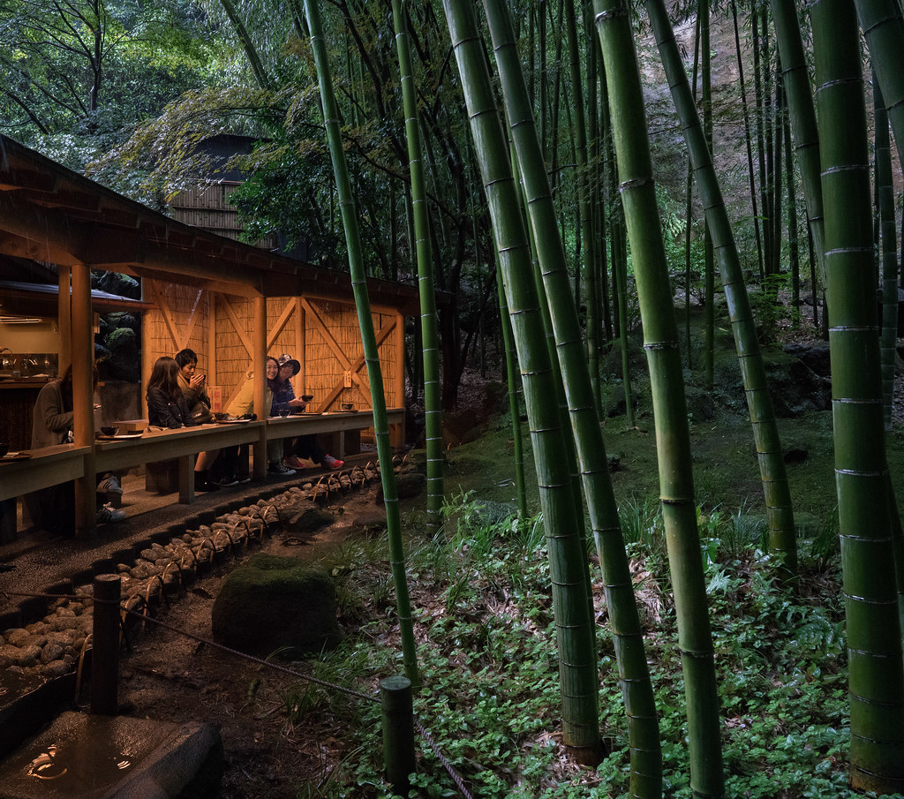
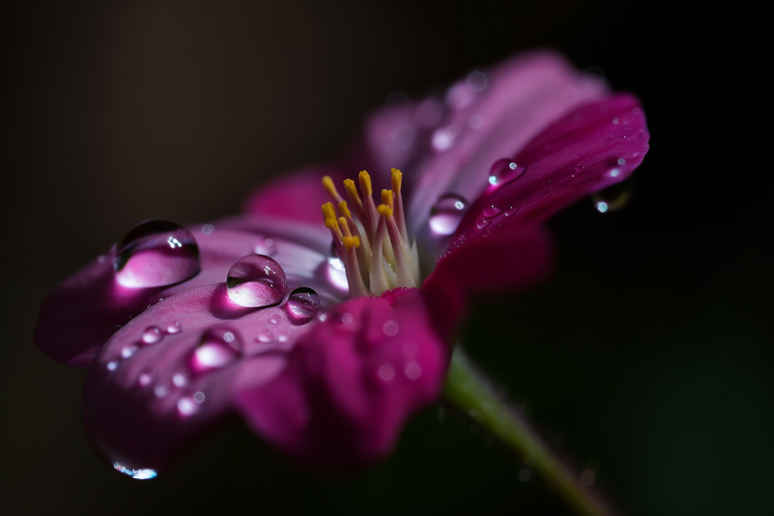
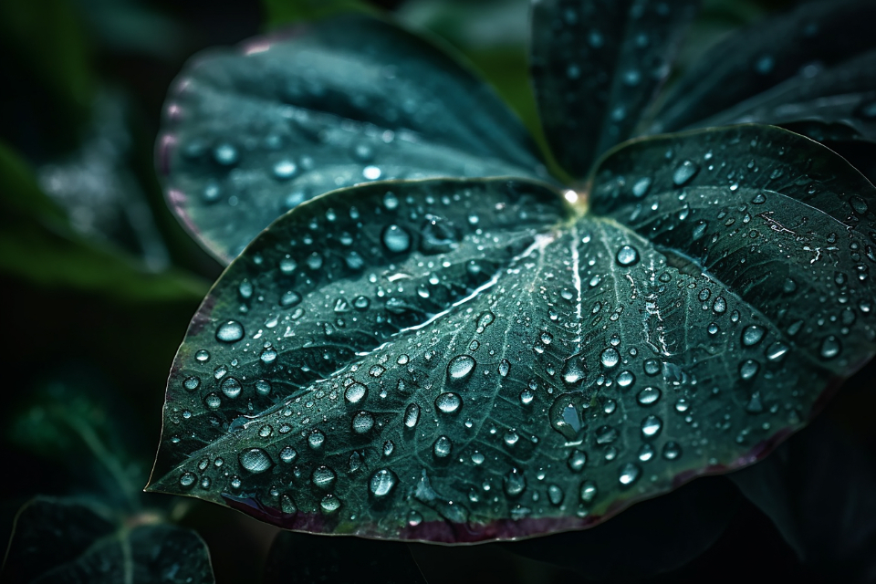

<html lang="en">
<head>
    <meta charset="UTF-8">
    <meta name="viewport" content="width=device-width, initial-scale=1.0">
    <title>Coffee Making Guide</title>
    <!-- Bootstrap CSS -->
    <link href="https://stackpath.bootstrapcdn.com/bootstrap/4.5.2/css/bootstrap.min.css" rel="stylesheet">
    
</head>
<body>
    <nav class="navbar navbar-expand-lg navbar-light bg-light">
        

            <ul class="navbar-nav">
                <li class="nav-item">
                    <a class="nav-link" href="https://kenzie-nice.github.io/Final_Page_At_Last.io/">Home</a>
                </li>
                <li class="nav-item">
                    <a class="nav-link" href="https://kenzie-nice.github.io/Final-stuff.io/">Contact Us</a>
                </li>
                <li class="nav-item">
                    <a class="nav-link" href="https://kenzie-nice.github.io/FinalAbout.io/">About Us</a>
                </li>
            </ul>
        

    </nav>

    
  
        <h3></h3> 
        
Natural rain makes everything look so pretty, though a professional photographer also helps.

        <h1></h1> 
           
Rain as expected, does help plants grow as it carries an important biological function for a plant. But it can also do more than help sustain the plant; it can assist even with pollination.

        <h2></h2> 
         
I Leaf.....

    

    <!-- HTML5 Canvas -->
    <canvas id="myCanvas" width="400" height="200"></canvas>
    <!-- Bootstrap JavaScript -->
    
    
    
    <!-- JavaScript for Canvas -->
    
</body>
</html>

